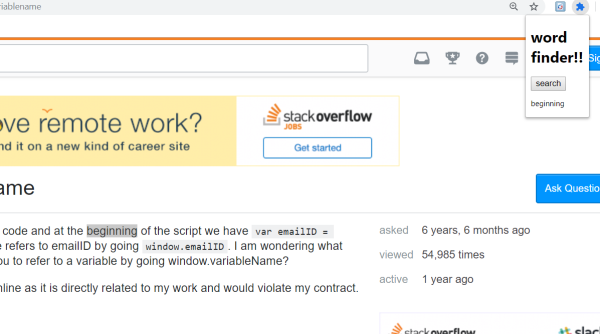
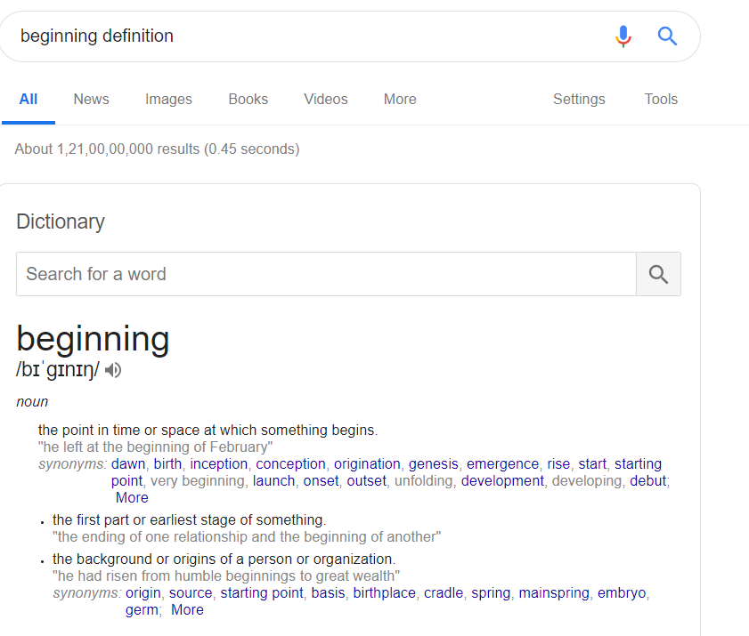

# word-search
This is an extension that searches word by just selecting it!!
“Word Search” Extension:
This google chrome extension is used to search any word on a web-page by just selecting it and clicking on the icon of the extension.
How the extension was developed:
1)	Started by creating the “manifest.json” file.
2)	Then I made “popup.html” file.
3)	Then I wrote “content.js” file which reads the selected word.
4)	Then the word is sent to “background.js” file and thereafter to “popup.js” which searches on net after the user clicks the search button.
Screen shots:
Before clicking search button:

 
After clicking search button:

 
